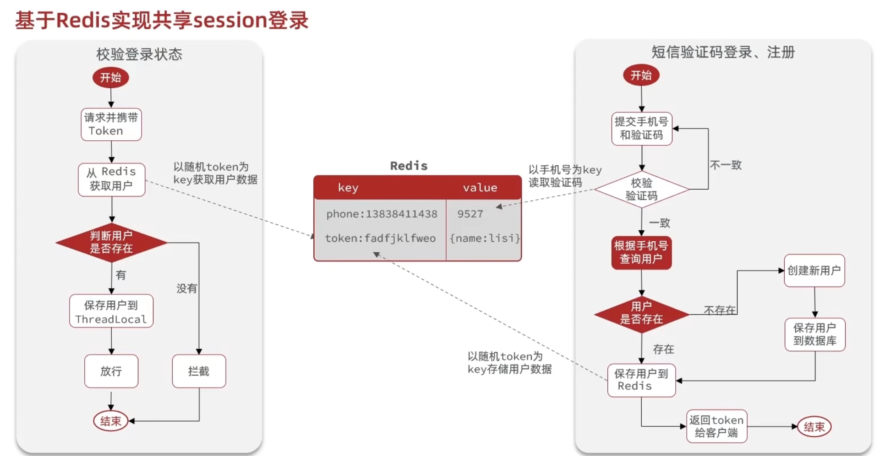
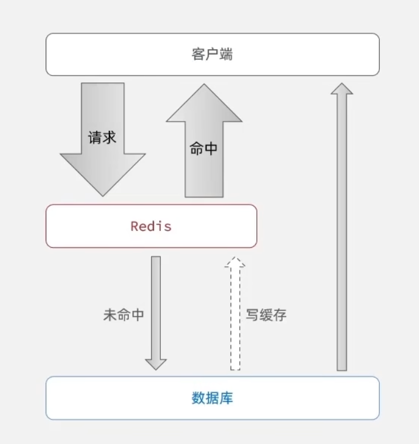
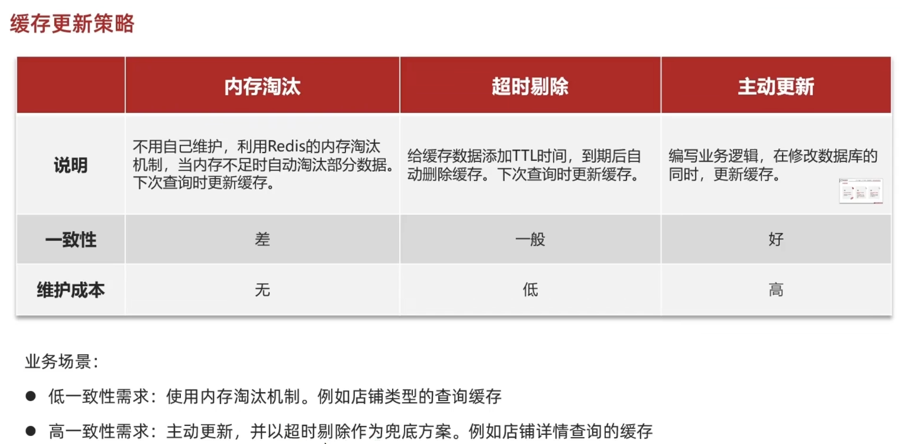
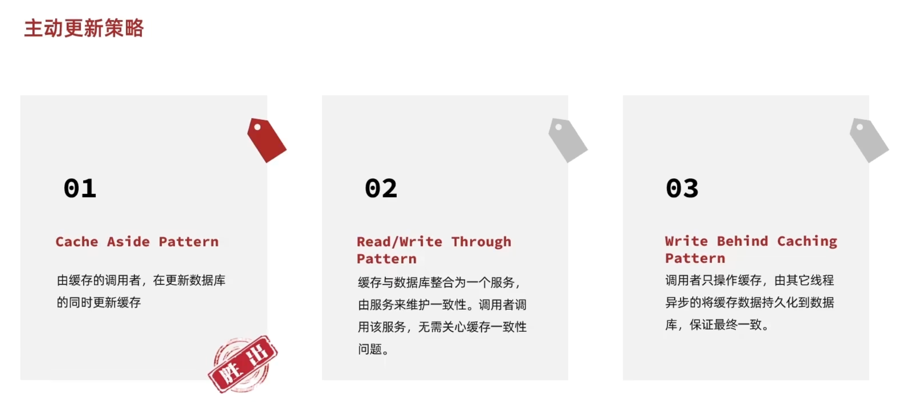
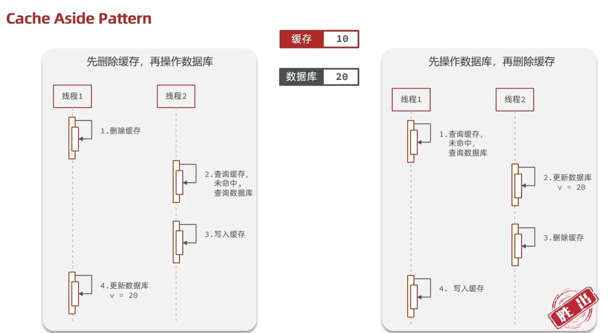
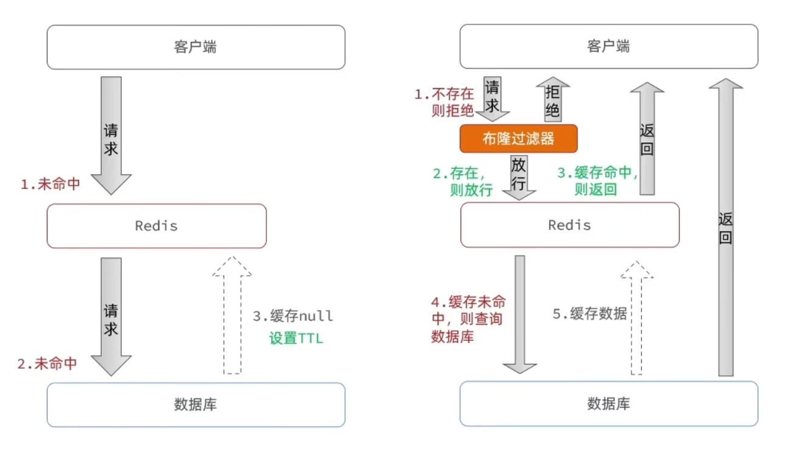
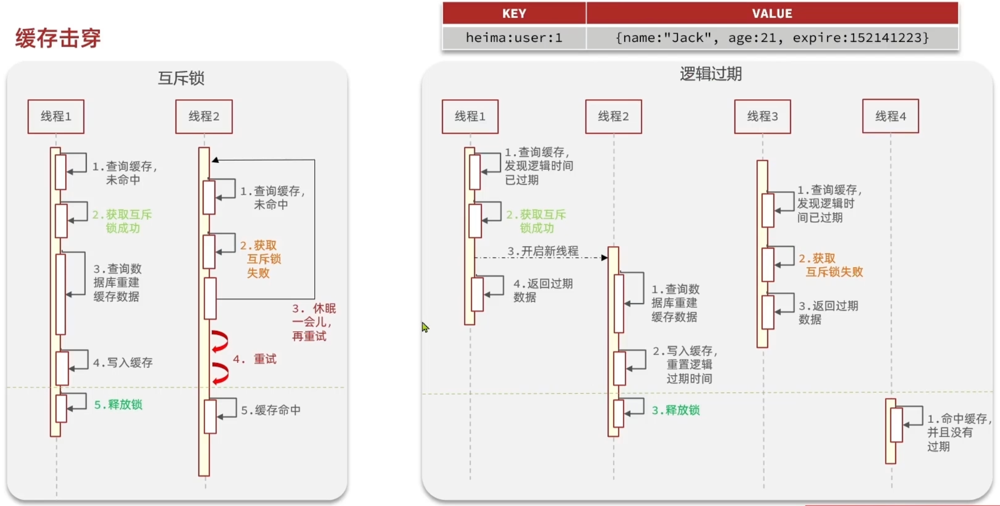
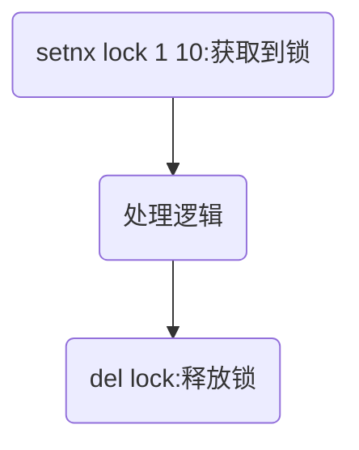

# Redis实战

## 短信登录session保存

若使用了均衡负载,请求分配到其他服务器的tomcat会导致session共享数据不一致问题

Redis正满足保存session的需求

## 业务缓存

web应用查询数据过程

可在查询数据库之前插入Redis缓存,防止大量请求访问数据库

### 缓存更新策略

- 缓存问题
  - 当对数据库的数据进行了更新,缓存并不会理解改变
  - 缓存一直放在内存当中容易造成缓存溢出

缓存策略

>后两个策略有宕机丢失数据的风险

在更新缓存的同时又有线程安全问题,多个线程对缓存进行操作

- 缓存更新策略
  - 主动更新,超时策略 做兜底
  - 在更新数据库的时候更新缓存
  - 先更新数据库再更新缓存

### 缓存穿透问题

缓存穿透:客户端访问一个缓存和数据库中都不存在的数据,请求会直接打到数据库,并发请求导致数据库崩溃

- 解决方案
  - 缓存空对象:在第一次访问缓存和数据库都为空时,将空结果写入缓存并加上ttl,但是会导致短暂的数据不一致问题
  - 布隆过滤器:将数据是否存在通过哈希算法(数据是否存在取决于是0还是1)保存到布隆过滤器中,但又导致误判的风险(布隆过滤器说存在但不一定存在,说不存在一定不存在)

- 额外的方案
  - 对主键id进行加强,带有一定的规律和随机性
  - 对用户进行过滤,强化权限管理
  - 数据对基础格式校验
  - 对热点id进行分流

### 缓存雪崩问题

缓存雪崩:同一时间内大量key失效,Redis服务失效,大量请求在同一时间内打到数据库内导致数据库崩溃

- 解决方案
  - 给ttl增加随机值
  - Redis集群模式,利用哨兵模式监控Redis服务
  - 添加多级缓存,例如本地缓存,nginx缓存,jvm缓存
  - 缓存降级限流服务

### 缓存击穿问题

缓存击穿:热点key失效问题,在高并发请求状态下热点key或者重新建立缓存复杂服务下突然失效,导致大量数据打到数据库内导致数据库崩溃

- 解决方案
  - 互斥锁:在重建逻辑的过程中加锁,但重建缓存的逻辑过于复杂时会导致接口的请求时间过长
  - 逻辑过期:不设置ttl,在缓存字段中添加expire_time字段,当获取到检测到过期先返回旧数据保证不卡顿,再创建一个新的线程去更新缓存

#### 互斥锁解决方案

可使用Redis到setnx命令设计互斥锁,setnx的作用是当存在key的话就不赋值,思路为分布式锁的基本原理,获取到锁进入修改数据库的过程,未获取到锁意味着有进程正在修改,当前线程等待一段时间再查询缓存;若进程出现问题,未成功释放锁就会导致等待问题,此时就需要设置ttl(通常为10s)

#### 逻辑过期解决方案
