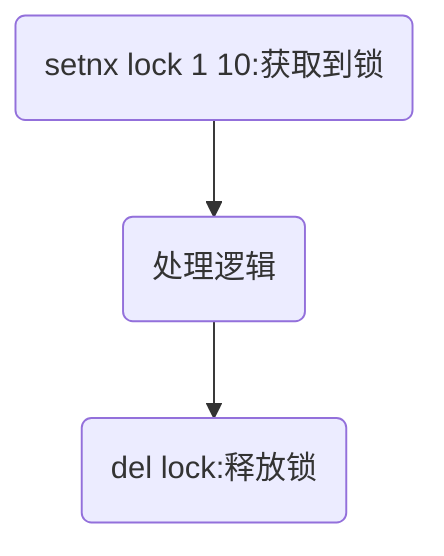
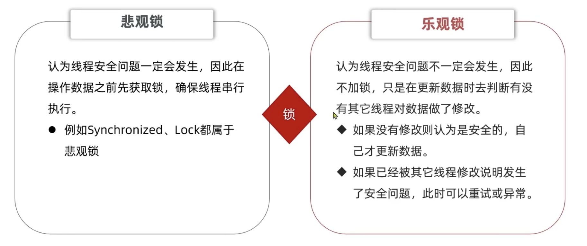
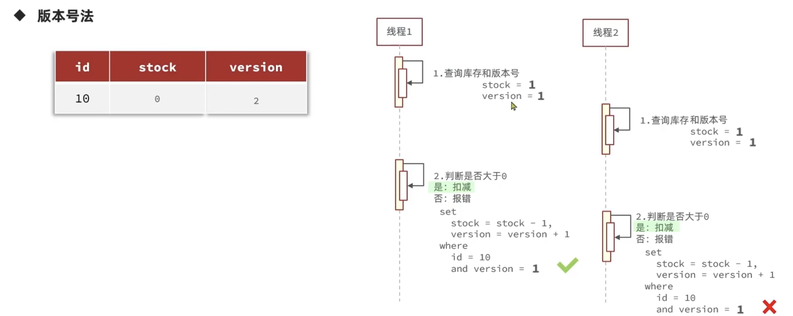
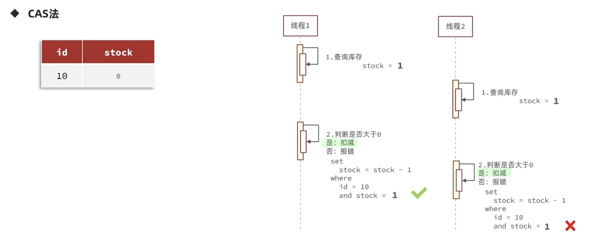

# Redis实战

## 短信登录session保存

若使用了均衡负载,请求分配到其他服务器的tomcat会导致session共享数据不一致问题

Redis正满足保存session的需求


## 业务缓存

web应用查询数据过程


可在查询数据库之前插入Redis缓存,防止大量请求访问数据库


### 缓存更新策略

- 缓存问题
  - 当对数据库的数据进行了更新,缓存并不会理解改变
  - 缓存一直放在内存当中容易造成缓存溢出


缓存策略


>后两个策略有宕机丢失数据的风险

在更新缓存的同时又有线程安全问题,多个线程对缓存进行操作


- 缓存更新策略
  - 主动更新,超时策略 做兜底
  - 在更新数据库的时候更新缓存

### 缓存穿透问题

缓存穿透:客户端访问一个缓存和数据库中都不存在的数据,请求会直接打到数据库,并发请求导致数据库崩溃

- 解决方案
  - 缓存空对象:在第一次访问缓存和数据库都为空时,将空结果写入缓存并加上ttl,但是会导致短暂的数据不一致问题
  - 布隆过滤器:将数据是否存在通过哈希算法(数据是否存在取决于是0还是1)保存到布隆过滤器中,但又导致误判的风险(布隆过滤器说存在但不一定存在,说不存在一定不存在)


- 额外的方案
  - 对主键id进行加强,带有一定的规律和随机性
  - 对用户进行过滤,强化权限管理
  - 数据对基础格式校验
  - 对热点id进行分流

### 缓存雪崩问题

缓存雪崩:同一时间内大量key失效,Redis服务失效,大量请求在同一时间内打到数据库内导致数据库崩溃

- 解决方案
  - 给ttl增加随机值
  - Redis集群模式,利用哨兵模式监控Redis服务
  - 添加多级缓存,例如本地缓存,nginx缓存,jvm缓存
  - 缓存降级限流服务

### 缓存击穿问题

缓存击穿:热点key失效问题,在高并发请求状态下热点key或者重新建立缓存复杂服务下突然失效,导致大量数据打到数据库内导致数据库崩溃

- 解决方案
  - 互斥锁:在重建逻辑的过程中加锁,但重建缓存的逻辑过于复杂时会导致接口的请求时间过长
  - 逻辑过期:不设置ttl,在缓存字段中添加expire_time字段,当获取到检测到过期先返回旧数据保证不卡顿,再创建一个新的线程去更新缓存

#### 互斥锁解决方案


可使用Redis到setnx命令设计互斥锁,setnx的作用是当存在key的话就不赋值,思路为分布式锁的基本原理,获取到锁进入修改数据库的过程,未获取到锁意味着有进程正在修改,当前线程等待一段时间再查询缓存;若进程出现问题,未成功释放锁就会导致等待问题,此时就需要设置ttl(通常为10s)



#### 逻辑过期解决方案

默认缓存命中,ttl为-1

获取锁,开启新的线程(ExecutorService)去读取数据库数据并写入Redis缓存

## 秒杀业务

- 秒杀业务的主键id不能自增
  - 订单量太多id会重复,也可能会爆表
  - 自增id容易暴露信息

此时就需要全局id生成器

- 全局id生成器
  - 唯一性
  - 自增性(方便mysql建立索引)
  - 安全性

可使用Redis的incr命令自增,再拼接上其他的字符串(最好带上时间相关的信息)

>不能使用UUID,UUID无序,无法建立索引

参考算法:

```java
public Long nextId(String keyPrefix) {
    //生成时间戳
    LocalDateTime now = LocalDateTime.now();
    long nowSecond = now.toEpochSecond(ZoneOffset.UTC);
    long timestamp = nowSecond - BEGIN_TIMESTAMP;
    //生成序列号
    //生成当前日期 精确到天
    String today = now.format(DateTimeFormatter.ofPattern("yyyyMMdd"));
    //自增长
    Long count = stringRedisTemplate.opsForValue().increment("icr:" + keyPrefix + ":" + today);
    //拼接并返回
    return timestamp << 32|count;  //二进制运算
}
```

推荐使用雪花算法:

```java

/**
 * twitter的snowflake算法 -- java实现
 *
 * @author beyond
 * @date 2016/11/26
 */
public class SnowFlake {

    /**
     * 起始的时间戳
     */
    private final static long START_STMP = 1480166465631L;

    /**
     * 每一部分占用的位数
     */
    private final static long SEQUENCE_BIT = 12; //序列号占用的位数
    private final static long MACHINE_BIT = 5;   //机器标识占用的位数
    private final static long DATACENTER_BIT = 5;//数据中心占用的位数

    /**
     * 每一部分的最大值
     */
    private final static long MAX_DATACENTER_NUM = -1L ^ (-1L << DATACENTER_BIT);
    private final static long MAX_MACHINE_NUM = -1L ^ (-1L << MACHINE_BIT);
    private final static long MAX_SEQUENCE = -1L ^ (-1L << SEQUENCE_BIT);

    /**
     * 每一部分向左的位移
     */
    private final static long MACHINE_LEFT = SEQUENCE_BIT;
    private final static long DATACENTER_LEFT = SEQUENCE_BIT + MACHINE_BIT;
    private final static long TIMESTMP_LEFT = DATACENTER_LEFT + DATACENTER_BIT;

    private long datacenterId;  //数据中心
    private long machineId;     //机器标识
    private long sequence = 0L; //序列号
    private long lastStmp = -1L;//上一次时间戳

    public SnowFlake(long datacenterId, long machineId) {
        if (datacenterId > MAX_DATACENTER_NUM || datacenterId < 0) {
            throw new IllegalArgumentException("datacenterId can't be greater than MAX_DATACENTER_NUM or less than 0");
        }
        if (machineId > MAX_MACHINE_NUM || machineId < 0) {
            throw new IllegalArgumentException("machineId can't be greater than MAX_MACHINE_NUM or less than 0");
        }
        this.datacenterId = datacenterId;
        this.machineId = machineId;
    }

    /**
     * 产生下一个ID
     *
     * @return
     */
    public synchronized long nextId() {
        long currStmp = getNewstmp();
        if (currStmp < lastStmp) {
            throw new RuntimeException("Clock moved backwards.  Refusing to generate id");
        }

        if (currStmp == lastStmp) {
            //相同毫秒内，序列号自增
            sequence = (sequence + 1) & MAX_SEQUENCE;
            //同一毫秒的序列数已经达到最大
            if (sequence == 0L) {
                currStmp = getNextMill();
            }
        } else {
            //不同毫秒内，序列号置为0
            sequence = 0L;
        }

        lastStmp = currStmp;

        return (currStmp - START_STMP) << TIMESTMP_LEFT //时间戳部分
                | datacenterId << DATACENTER_LEFT       //数据中心部分
                | machineId << MACHINE_LEFT             //机器标识部分
                | sequence;                             //序列号部分
    }

    private long getNextMill() {
        long mill = getNewstmp();
        while (mill <= lastStmp) {
            mill = getNewstmp();
        }
        return mill;
    }

    private long getNewstmp() {
        return System.currentTimeMillis();
    }

    public static void main(String[] args) {
        SnowFlake snowFlake = new SnowFlake(2, 3);

        for (int i = 0; i < (1 << 12); i++) {
            System.out.println(snowFlake.nextId());
        }

    }
}
```

### 优惠卷秒杀超卖问题

现实业务中并发量巨大,当多个请求也就是多个线程对数据库进行操作的时候,会导致超卖问题

>并发模拟器:jmeter

超卖问题是经典的多线程安全问题,基础解决逻辑是加锁



- 锁
  - 悲观锁:每次都加锁,性能不太好
  - 乐观锁:数据变化采取检查加锁

#### 乐观锁

- 乐观锁判断数据是否被修改
  - 版本号法:在数据库中添加版本字段,当库存减少的时候版本变化,再根据版本是否变化来判断数据是否被修改
  - CAS法(Compare And Switch):简化版本的版本号法,查看库存本身是否大于0





此时的乐观锁会导致失败率大大提高,因为多个线程查询会导致查询到的内容相同导致逻辑失败,就需要修改逻辑

#### 悲观锁

要实现一人一单就需要对逻辑加锁,此时就只能使用悲观锁

但是在逻辑上加悲观锁会导致springboot事务管理实效(事务是针对当前对象加的锁),就需要获取动态代理对象才能调用方法

### 集群下的线程安全并发问题

在集群模式下,经过nginx的均衡负载之后请求会被转发到多台机器,此时请求都会进入逻辑,也会导致超卖问题

在集群模式下synchronized无法生效,就需要分布式锁

具体查看[5.基于Redis的分布式锁](5.基于Redis的分布式锁.md)
