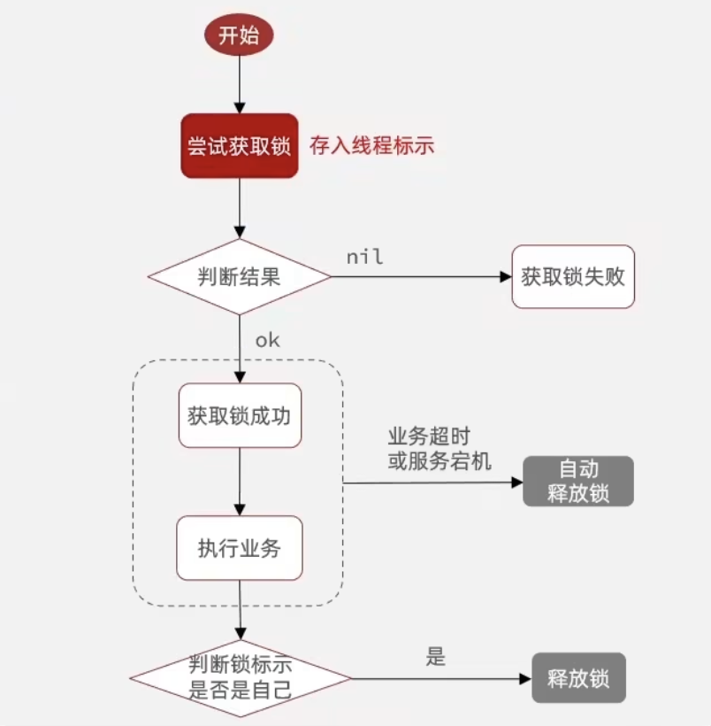
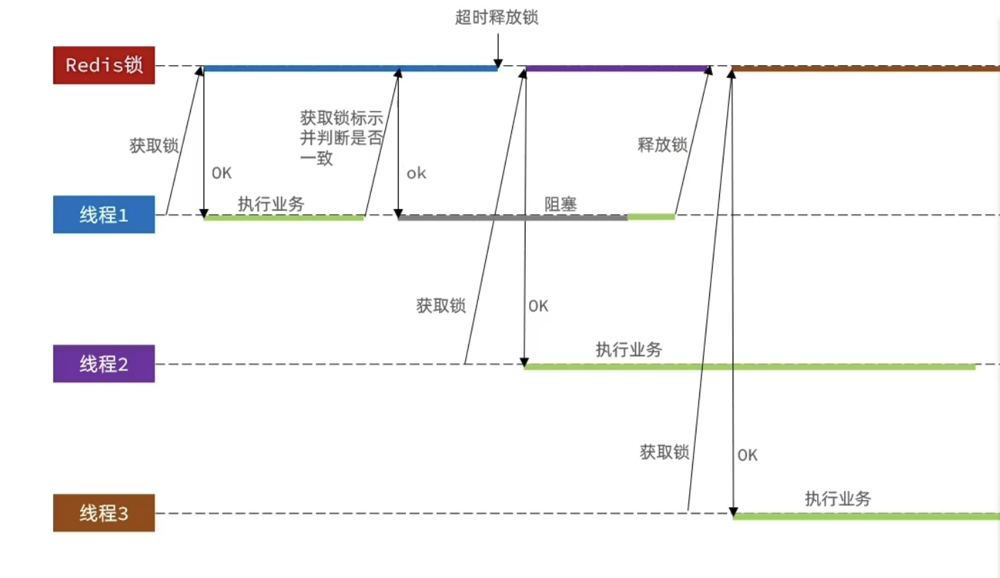

# 分布式锁

基本思想是创建一个独立于jvm之外的多进程可见锁监听器

从互斥性(setnx),高性能(单线程),可用性(key的自动过期)上可以看出使用Redis来做分布式锁最合适

- 基于Redis实现的分布式锁
  - 获取锁:SET lock thread1 NX EX 10(添加key并且添加超时时间且互斥)
  - 释放锁:DEL lock
    - 阻塞式:等待获取到锁再执行接下来的逻辑
    - 非阻塞式:直接返回一个结果

但是此锁也有误删锁的问题:当线程1阻塞时间太长导致锁自动释放了,线程2就会获取锁,此时线程1醒了,就会把线程2的锁删去,导致线程安全问题,此时就需要判断锁是否属于自己



但是当线程1已经判断锁属于自己了,准备释放锁的时候发生了jvm的垃圾回收导致代码堵塞,若堵塞时间够长导致锁自动释放了,线程2就会获取到锁,此时线程1堵塞结束释放了线程2的锁,就会导致问题,就需要保证判断锁和释放锁的原子性



Redis提供了使用lua脚本执行多条命令的操作以确保操作的原子性

## lua脚本

### 执行Redis命令的lua函数

```lua
redis.call('set','key','value')
```

- redis执行lua脚本命令
  - EVAL script numbers key [key ...] arg [arg ...]:执行脚本并且添加参数

### 脚本传参

>lua语言的数组下标以1开头

可使用`KEYS[1]`和`ARGS[1]`来获取传递的参数

使用lua脚本实现分布式锁

```lua
-- 比较线程标示与锁中的标示是否一致
if(redis.call('get',KEYS[1])==ARGV[1]) then
    --释放锁 del key
    return redis.call('del',KEYS[1])
end
return 0
```

### Java调用lua脚本

推荐使用RedisTemplate中的execute方法来执行lua脚本

```java
@Override
public <T> T execute(RedisScript<T> script, List<K> keys, Object... args) {
  return scriptExecutor.execute(script, keys, args);
}
```

- 参数分析
  - RedisScript\<T>:初始化一个脚本
  - List\<K>:参数keys集合
  - Object...:额外的参数

## 额外的问题

- 基于setnx实现的分布式锁存在以下问题
  - 不可重入:同一个线程不可重复获取相同一把锁
  - 不可重试(不可堵塞):获取锁失败就返回false,没有重试阶段
  - 超时释放:虽然有超时自动释放锁,但是若业务逻辑实现时间长依然会有线程安全问题
  - 主从一致性:主从节点同步锁的时候存在延迟

Redisson提供了多种分布式服务类和锁
