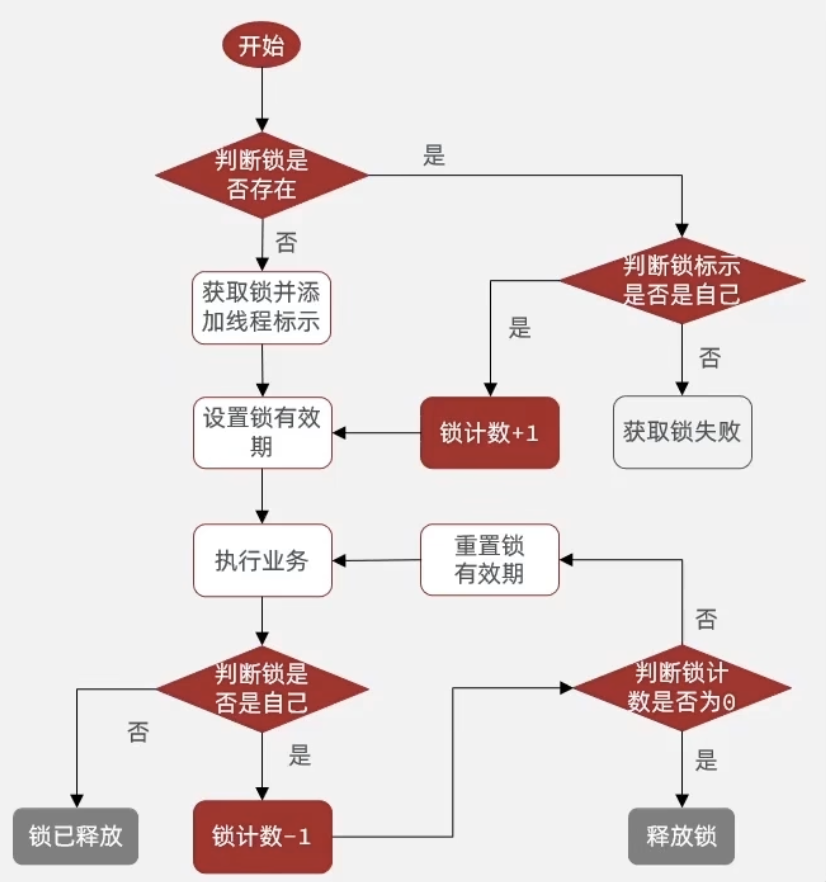
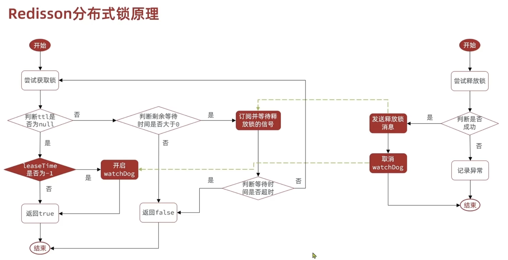
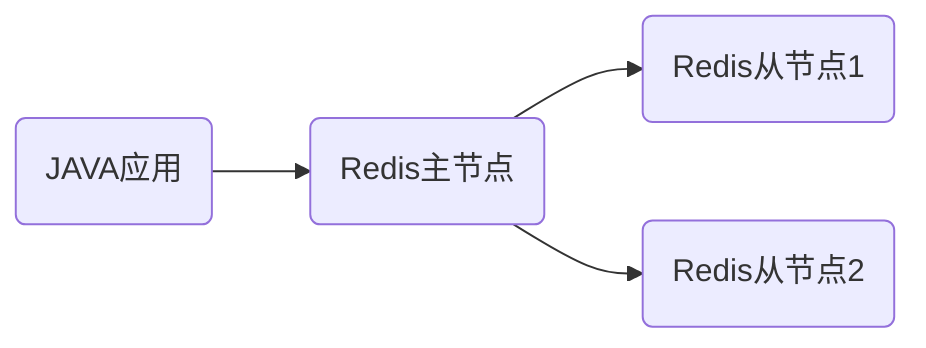
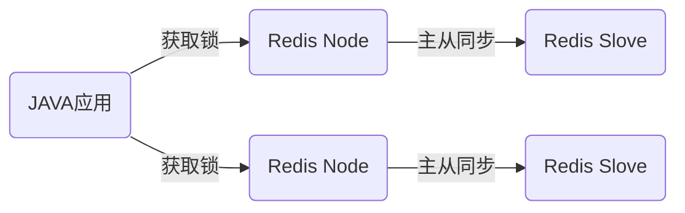

# Redisson中的分布式服务

## 配置Redisson

```java
@Configuration
public class RedissonConfig {
    @Bean
    public RedissonClient redissonClient(){
        //配置
        Config config = new Config();
        config.useSingleServer().setAddress("redis://127.0.0.1:6379");
        return Redisson.create(config);
    }
}
```

>不推荐使用yaml文件配置,会覆盖springboot对redis中的配置

基础加锁

```java
RLock rLock = redissonClient.getLock("anyLock");
try {
    boolean lock = rLock.tryLock(1, 10, TimeUnit.SECONDS);
    
    if(lock) {
        try {
            System.out.println("实现逻辑");
        } finally {
            rLock.unlock();
        }
    }
    
} catch (InterruptedException e) {
    throw new RuntimeException(e);
}
```

## 可重入锁(Rlock)原理

可重入锁:同一个线程里调用嵌套方法并且都获取锁的时候可以重复获取锁

思路:参考jdk自带的ReentrantLock思路添加计数器,每次获取锁的时候判断锁是否属于当前线程,若属于当前线程,计数器加一,释放锁时不删除锁,而是计数器减一,在判断计数器是否为零决定是否释放锁



## Redisson的锁重试和看门狗机制



锁重试机制:利用订阅机制和信号量机制

锁重试机制不是简单的轮训重试,而是先尝试获取锁,获取失败订阅频道阻塞等待通知,再次去利用时间判断尝试获取锁

- 可重入:利用hash结构记录线程id和重入次数
- 可重试:利用信号量和pubsub功能
- 超时续约:利用watchDog,每隔一段时间重置超时时间

### 主从一致性

在日常业务中,若redis服务器挂了,其他依赖于redis的业务都会挂掉,因此一般部署成redis集群,利用一个主节点增删改,其他从节点读



但是这样主从之间要有数据同步的步骤,若主节点挂了,其他从节点变为主节点但是数据没有同步的时候,就会出现线程问题

Redisson将所有节点都变成主节点,再给他们都配一台从节点,需要所有节点都获取到锁才能算是获取到锁



创建联锁

```java
RedissionClient redissionClient;
RedissionClient redissionClient2;
RedissionClient redissionClient3;

Rlock lock1 = redissionClient.getLock("order");
Rlock lock2 = redissionClient.getLock("order");
Rlock lock3 = redissionClient.getLock("order");

Rlock lock = new RedissonMultiLock(lock1,lock2,lock3);
```

需要全部锁都获取到才能算锁获取成功
